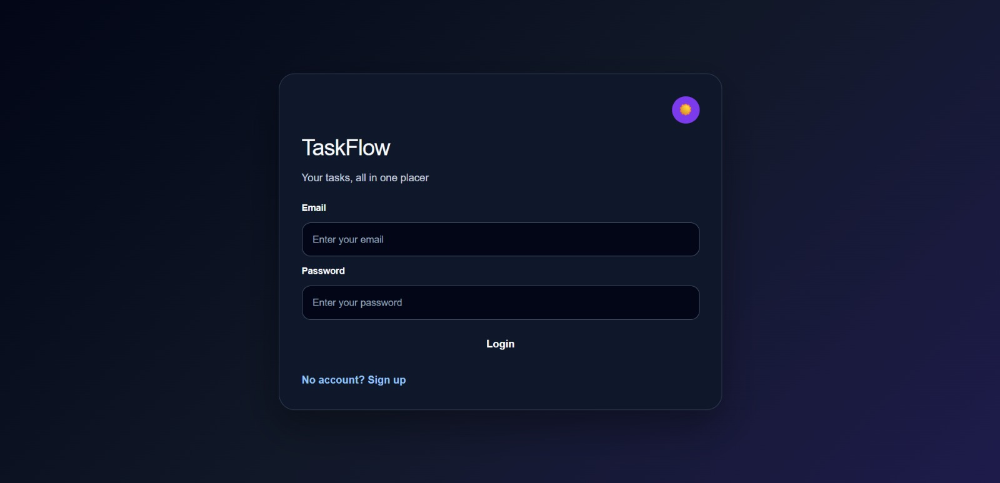
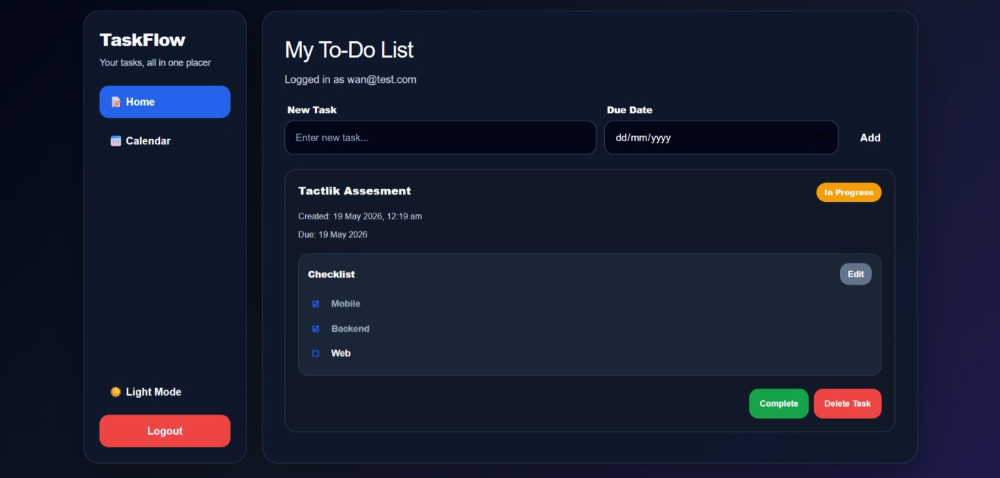
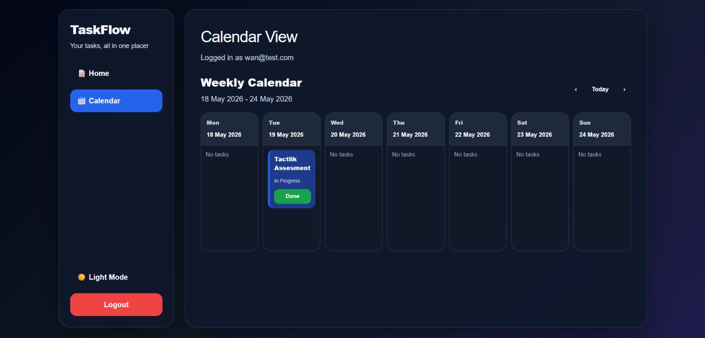
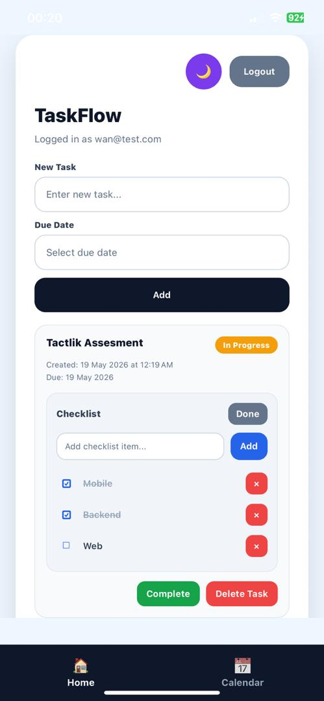
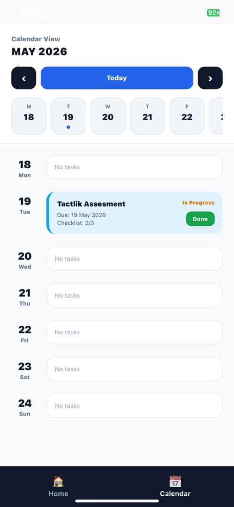

# Project Title

A brief description of what this project does and who it's for

# TaskFlow

TaskFlow is a full-stack task management application developed for the Tactlink Software Engineer technical assessment.

The project includes a GraphQL backend, a React web application, an Expo React Native mobile application, live deployment links, and an AWS deployment plan.

TaskFlow allows users to manage tasks with due dates, checklist items, completion status, dark mode, and calendar-based task viewing.

---

## Project Links

- GitHub Repository: https://github.com/wanaliffluqman/TaskFlow
- Live Web App: https://task-flow-bay-phi.vercel.app/
- Backend API: https://taskflow-d3p9.onrender.com/
- GraphQL Endpoint: https://taskflow-d3p9.onrender.com/graphql

---

## Project Structure

```text
TaskFlow/
├── Backend/
│   └── Node.js + Express + Apollo GraphQL backend
│
├── Web/
│   └── React web application deployed on Vercel
│
└── mobile/
    └── Expo React Native mobile application
```

---

## Features

### Backend

- Node.js backend using Express
- Apollo GraphQL API
- User signup and login
- Add task
- Delete task
- Complete and undo task
- Add checklist item
- Toggle checklist item
- Delete checklist item
- Task due date support
- Created timestamp support
- Completed timestamp support

### Web App

- React web application
- Login and signup flow
- Add task with mandatory due date
- Checklist/subtask management
- Complete, undo, and delete task
- Calendar view grouped by due date
- Previous week, current week, and next week navigation
- Dark mode
- Responsive layout
- Sidebar navigation for Home and Calendar views
- Deployed on Vercel

### Mobile App

- Expo React Native application
- Login screen before accessing the app
- Bottom tab navigation after successful login
- Home tab for task management
- Calendar tab with weekly agenda view
- Native date picker for due date selection
- Checklist/subtask support
- Complete and undo task support
- Shared dark mode between Home and Calendar screens

---

## Screenshots

### Web App

#### Login View

The web login screen supports authentication and dark mode styling.



#### Home View

The web home screen allows users to add tasks, set due dates, manage checklist items, complete tasks, and delete tasks.



#### Calendar View

The web calendar view groups tasks by due date and allows users to navigate between weeks.



---

### Mobile App

#### Home View

The mobile home screen provides task management with due date selection, checklist items, completion status, and bottom tab navigation.



#### Calendar View

The mobile calendar uses an agenda-style weekly view for easier scrolling on smaller screens.



## Setup Instructions

### 1. Backend Setup

Navigate to the backend folder:

```bash
cd Backend
```

Install dependencies:

```bash
npm install
```

Start the backend server:

```bash
npm run dev
```

The backend runs locally at:

```text
http://localhost:4000
```

GraphQL endpoint:

```text
http://localhost:4000/graphql
```

Production backend endpoint:

```text
https://taskflow-d3p9.onrender.com/graphql
```

---

### 2. Web App Setup

Navigate to the web folder:

```bash
cd Web
```

Install dependencies:

```bash
npm install
```

Create a local environment file:

```text
Web/.env
```

Add the GraphQL endpoint:

```env
VITE_GRAPHQL_URL=https://taskflow-d3p9.onrender.com/graphql
```

Start the web app:

```bash
npm run dev
```

The web app usually runs at:

```text
http://localhost:5173
```

Production web app:

```text
https://task-flow-bay-phi.vercel.app/
```

---

### 3. Mobile App Setup

Navigate to the mobile folder:

```bash
cd mobile
```

Install dependencies:

```bash
npm install
```

Create a local environment file:

```text
mobile/.env
```

Add the GraphQL endpoint:

```env
EXPO_PUBLIC_GRAPHQL_URL=https://taskflow-d3p9.onrender.com/graphql
```

Start the Expo app:

```bash
npx expo start
```

Open the app using Expo Go.

---

## Environment Variables

### Web

The web app uses Vite environment variables.

```env
VITE_GRAPHQL_URL=https://taskflow-d3p9.onrender.com/graphql
```

A sample file is provided as:

```text
Web/.env.example
```

### Mobile

The mobile app uses Expo public environment variables.

```env
EXPO_PUBLIC_GRAPHQL_URL=https://taskflow-d3p9.onrender.com/graphql
```

A sample file is provided as:

```text
mobile/.env.example
```

The actual `.env` files are ignored from Git for safety.

---

## GraphQL API Overview

### Example Query

```graphql
query {
  todos {
    id
    title
    completed
    createdAt
    completedAt
    dueDate
    checklistItems {
      id
      title
      completed
    }
  }
}
```

### Main Mutations

The backend supports the following main mutations:

- `signup`
- `login`
- `addTodo`
- `toggleTodo`
- `deleteTodo`
- `addChecklistItem`
- `toggleChecklistItem`
- `deleteChecklistItem`

---

## Architecture Decisions

### 1. GraphQL Backend

GraphQL was selected because both the web and mobile clients can consume the same structured API. Apollo Server with Express was used because it is simple, flexible, and suitable for this assessment.

### 2. React Web App

React was used for the web application because it supports fast component-based UI development. The web app uses a sidebar layout because it is more suitable for desktop usage.

### 3. Expo React Native Mobile App

Expo React Native was used for the mobile app to allow faster testing through Expo Go. The mobile app uses bottom tab navigation because it is a more natural mobile navigation pattern compared to a sidebar layout.

### 4. Calendar Design

The web app uses a weekly calendar board layout because desktop screens have more horizontal space.

The mobile app uses a weekly agenda layout because vertical scrolling is more suitable for smaller mobile screens.

### 5. Dark Mode

The web app uses CSS-based dark mode styling.

The mobile app uses a shared Theme Context so that dark mode applies consistently across Home and Calendar screens.

### 6. Authentication Flow

The mobile app separates authentication from the main app navigation.

Flow:

```text
Open app → Login screen → Login success → Home and Calendar tabs
```

This prevents users from accessing the Home or Calendar tab before login.

### 7. Data Storage

For assessment simplicity, the backend currently uses in-memory arrays for users and tasks.

This keeps the project lightweight and easy to run. For production, this should be replaced with persistent storage such as PostgreSQL, Amazon RDS, or DynamoDB.

---

## Current Deployment

### Backend

The backend is deployed on Render for live testing.

```text
https://taskflow-d3p9.onrender.com/
```

GraphQL endpoint:

```text
https://taskflow-d3p9.onrender.com/graphql
```

### Web

The web app is deployed on Vercel.

```text
https://task-flow-bay-phi.vercel.app/
```

---

## Cloud Deployment Plan - AWS

The backend is currently deployed on Render for live testing. For the AWS cloud requirement, this section provides the alternative AWS deployment plan, including architecture, services, deployment steps, and cost estimate.

---

### Proposed AWS Architecture

```text
User
 │
 ├── Web App hosted on Vercel
 │
 ├── Mobile App using Expo / React Native
 │
 └── GraphQL API hosted on AWS EC2
          │
          ├── Node.js
          ├── Express
          ├── Apollo Server
          └── PM2 Process Manager
```

---

### Proposed AWS Services

| Service                          | Purpose                                           |
| -------------------------------- | ------------------------------------------------- |
| Amazon EC2                       | Host the Node.js Express + Apollo GraphQL backend |
| Security Group                   | Allow inbound HTTP traffic to the backend port    |
| EBS                              | Store backend source code and server files        |
| PM2                              | Keep the Node.js backend running continuously     |
| Amazon RDS PostgreSQL / DynamoDB | Future persistent database storage                |
| Vercel                           | Host the React web frontend                       |

---

### AWS Deployment Steps

1. Launch an Ubuntu EC2 instance.
2. Install Node.js, npm, Git, and PM2.
3. Clone the GitHub repository into the EC2 instance.

```bash
git clone https://github.com/wanaliffluqman/TaskFlow.git
```

4. Navigate to the backend folder.

```bash
cd TaskFlow/Backend
```

5. Install backend dependencies.

```bash
npm install
```

6. Start the backend using PM2.

```bash
pm2 start index.js --name taskflow-backend
```

7. Save the PM2 process list.

```bash
pm2 save
```

8. Configure the EC2 Security Group to allow inbound traffic on the backend port.

9. Test the backend endpoint.

```text
http://<EC2_PUBLIC_IP>:4000/graphql
```

10. Update the web and mobile GraphQL API URL to point to the EC2 backend URL.

---

### Cost Estimate

For a small demo project, cost can be kept low by using a small EC2 instance and stopping it when not in use.

| Resource       | Estimate                                      |
| -------------- | --------------------------------------------- |
| EC2 instance   | Low cost depending on instance type and usage |
| EBS storage    | Small storage volume for backend files        |
| Data transfer  | Minimal for demo and assessment testing       |
| Domain / HTTPS | Optional future improvement                   |

For production, AWS Budgets and billing alerts should be enabled to monitor cost.

---

### Reason for Choosing EC2

EC2 is selected because the backend is currently built using Express and Apollo Server. This allows the backend to be deployed with minimal code changes.

AWS Lambda is also possible, but it would require converting the backend into a serverless handler and configuring API Gateway. For the current project structure, EC2 is the safer and more practical deployment option.

---

### Future AWS Improvements

- Deploy backend to AWS EC2 with PM2.
- Replace in-memory storage with Amazon RDS PostgreSQL or DynamoDB.
- Add environment variables for production configuration.
- Add HTTPS using a domain and SSL certificate.
- Add CI/CD deployment pipeline.
- Optionally migrate backend to AWS Lambda and API Gateway for serverless scaling.

---

## Testing Checklist

### Backend

- GraphQL server starts successfully.
- `todos` query returns task data.
- Signup and login mutations work.
- Task mutations work.
- Checklist mutations work.

### Web

- User can sign up and log in.
- User can add task with due date.
- User can add checklist items.
- User can complete and undo task.
- User can delete task.
- Calendar view displays tasks by due date.
- Dark mode works.
- Responsive layout works.

### Mobile

- App opens to login screen.
- Bottom tab navigation appears after successful login.
- User can add task with native date picker.
- User can add checklist items.
- User can complete and undo task.
- Calendar agenda view displays tasks by week.
- Dark mode applies to both Home and Calendar.
- Logout returns user to login screen.

---

## Known Limitations

- Data is stored in memory, so data resets when the backend server restarts.
- Authentication is simplified for assessment purposes.
- The mobile app is intended to be tested using Expo Go.
- The backend is deployed on Render for live testing, while AWS deployment is provided as a deployment plan.
- Render free hosting may take some time to wake up after inactivity.

---

## Time Taken

The assessment guideline estimated around 5 - 6 hours total across mobile, backend, web, and cloud planning.

Estimated actual time spent: 6 - 8 hours.

| Task                                                     | Estimated Time |
| -------------------------------------------------------- | -------------- |
| Mobile App (React Native + Expo)                         | 2 hours        |
| Backend (Node.js + GraphQL)                              | 1.5 hours      |
| Web App (React + Vercel)                                 | 1.5 hours      |
| Additional improvements, testing, deployment, and README | 1 - 2 hours    |

Additional time was spent improving the user experience, including checklist items, due date picker, calendar/agenda view, dark mode, deployment setup, and final testing.

---

## Final Notes

TaskFlow was built to demonstrate full-stack development using a GraphQL backend, React web frontend, and Expo React Native mobile app.

The application includes task management, checklist support, due date handling, calendar views, dark mode, responsive web layout, mobile navigation, live web deployment, live backend deployment, and AWS deployment planning.
